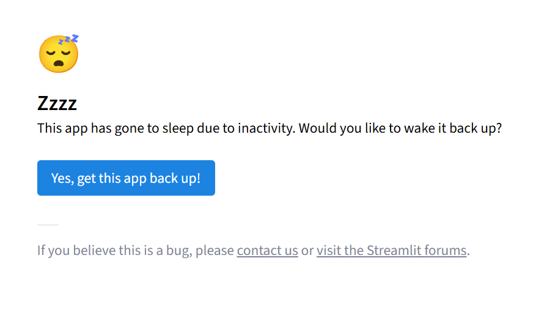

# LC-Deck-Maker

게임 림버스 컴퍼니에서 사용되는 파티 조합을 작성할 수 있는 프로그램입니다.

### [<u>앱 실행 링크</u>](https://limbuscompany-deckmaker.streamlit.app/)

 

- 현재 버전 (2024.11.12)  
**beta**

 

_주의사항: 버전 업데이트 시 프로그램이 강제종료 될 수 있습니다._

---

## 사용법

#### - 동기화/레벨 설정
각 인격과 에고의 동기화 단계(3~4)와 레벨을 설정할 수 있습니다.
**설정 다운로드** 버튼을 통해 CSS 파일로 설정을 저장하고 추후 이용 시 빠르게 설정을 조절할 수 있습니다.  
_(기본값: 4동기화/최대 레벨)_

#### - 인격 목록 / E.G.O 목록
**열 선택** 탭에서 확인하고 싶은 열을 체크하고 아래 표에서 확인할 수 있습니다.
특정 열은 **검색** 탭에서 원하는 키워드를 포함한 행만 모아서 볼 수 있습니다.

#### - 파티 구성
최대 6인까지 수감자를 넣고 인격을 설정할 수 있습니다. 우측 표에 각 죄악 자원 수급량이 표시되며, 상단 **죄악 자원 설정**으로 표시 방법을 바꿀 수 있습니다.  
**주요 E.G.O** 탭에서는 편성한 수감자의 E.G.O를 선택 가능하며 각 죄악 자원의 수급량-소모량 값을 확인할 수 있습니다.

---

모든 데이터의 권리와 저작권은 프로젝트 문 및 해당 저작권자의 소유입니다.
